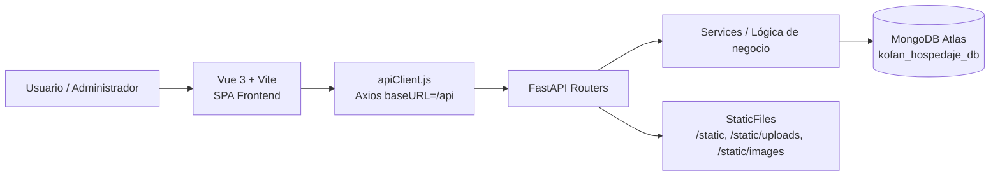

# 📘 Informe Técnico del Proyecto **Ecohotel Kofán**

**Institución:** SENA  
**Ficha:** 2997671  
**Fecha de corte:** 10 de abril de 2026  
**Metodología de trabajo:** **Scrumban**  
**Stack principal:** **FastAPI + Vue 3 + MongoDB**

---

## 1. Resumen ejecutivo

El proyecto **Ecohotel Kofán** es una plataforma web para la administración operativa y comercial de un servicio de hospedaje. La solución está dividida en dos capas principales:

- **Backend (`/backend`)**: API REST construida con **FastAPI**, encargada de autenticación, reglas de negocio, acceso a MongoDB, gestión de reservas, usuarios, habitaciones, galería y configuración del hotel.
- **Frontend (`/frontend`)**: aplicación SPA construida con **Vue 3 + Vite**, responsable de la interfaz de cliente, panel administrativo, formularios, navegación y consumo de la API.
- **Persistencia (`MongoDB`)**: base de datos `kofan_hospedaje_db`, accedida mediante `motor` para operaciones asíncronas.

El sistema opera con autenticación JWT, separación de roles, vistas públicas y privadas, y control administrativo para gestionar usuarios, reservas, habitaciones, galería y parámetros institucionales del hotel.

---

## 2. Enfoque metodológico Scrumban

El proyecto se alinea con **Scrumban**, integrando prácticas de Scrum y Kanban:

- **Backlog priorizado** por módulos funcionales: usuarios, reservas, habitaciones, galería, configuración.
- **Flujo continuo** de tareas por columnas típicas: `Pendiente` → `En progreso` → `En validación` → `Terminado`.
- **Límites WIP** para evitar sobrecarga en desarrollo y pruebas.
- **Entregas incrementales**: primero diseño y navegación, luego integración API, finalmente estabilización y optimización.
- **Validación técnica continua** mediante compilación de frontend y ajustes iterativos en backend.

---

## 3. Arquitectura general del sistema

### Componentes técnicos principales

| Capa | Archivo / Ubicación | Responsabilidad |
|---|---|---|
| Entrada backend | `backend/main.py` | Inicializa FastAPI, CORS, rutas, tareas programadas e índices MongoDB |
| Conexión BD | `backend/db/client.py` | Conecta con `kofan_hospedaje_db` mediante `AsyncIOMotorClient` |
| API frontend | `frontend/src/api/apiClient.js` | Centraliza peticiones Axios, token JWT e interceptores 401 |
| Navegación SPA | `frontend/src/router/index.js` | Define vistas públicas, autenticación, panel cliente y panel admin |
| Persistencia | MongoDB | Colecciones: `users`, `bookings`, `rooms`, `gallery`, `settings`, `notifications`, `invoices`, `room_logs` |

---

## 4. Estructura del repositorio

| Ruta | Tipo | Descripción técnica |
|---|---|---|
| `/README.md` | Documento | Descripción general del proyecto y stack de frontend |
| `/backend/main.py` | Backend | Punto de arranque de la API FastAPI |
| `/backend/routers/` | Backend | Endpoints REST por dominio funcional |
| `/backend/services/` | Backend | Reglas de negocio y acceso a datos |
| `/backend/models/` | Backend | Modelos Pydantic de entrada/salida |
| `/backend/schemas/` | Backend | Serializadores y estructuras normalizadas |
| `/backend/db/client.py` | Backend | Configuración de MongoDB Atlas |
| `/frontend/src/router/index.js` | Frontend | Enrutamiento del sistema |
| `/frontend/src/views/` | Frontend | Vistas públicas, auth, app y admin |
| `/frontend/src/services/` | Frontend | Servicios que consumen la API |
| `/frontend/src/stores/` | Frontend | Estado global con Pinia |
| `/frontend/src/components/` | Frontend | Componentes reutilizables y modales |

---

## 5. Mapeo completo entre rutas FastAPI y vistas Vue

### 5.1 Rutas principales del frontend

| Ruta Vue | Vista / Layout | Propósito | Endpoint(s) backend relacionados |
|---|---|---|---|
| `/` | `LandingPortal.vue` | Portal de entrada institucional | Sin consumo principal directo |
| `/hospedaje` | `PublicLayout.vue` + `Home.vue` | Inicio público del hospedaje | `GET /gallery/` |
| `/hospedaje/gallery` | `PhotosGallery.vue` | Galería pública | `GET /gallery/` |
| `/hospedaje/rooms` | `Catalog.vue` | Catálogo público de alojamientos | `GET /rooms/` *(operativamente debería apuntar a `GET /rooms/public`)* |
| `/auth/login` | `Login.vue` | Inicio de sesión | `POST /auth/login` |
| `/auth/register` | `Register.vue` | Registro de cliente | `POST /register/`, `POST /auth/login` |
| `/app/profile` | `ProfileView.vue` | Perfil del usuario autenticado | `GET /users/me` |
| `/app/settings` | `SettingsView.vue` | Actualización del perfil propio | `PATCH /users/update-me` |
| `/app/bookings` | `BookingsView.vue` | Consulta de reservas del cliente | `GET /api/reservas/mis-reservas` |
| `/app/notifications` | `NotificationsView.vue` | Avisos del usuario | `GET /api/notificaciones/mis-avisos`, `PATCH /api/notificaciones/read-all` |
| `/admin/dashboard` | `DashboardView.vue` | KPIs operativos | `GET /dashboard` |
| `/admin/rooms` | `RoomsManager.vue` | CRUD de habitaciones / inventario | `GET/POST/PUT/DELETE /rooms*` |
| `/admin/bookings` | `BookingsManager.vue` | Gestión administrativa de reservas | `GET /api/reservas/admin/todas`, `PATCH /api/reservas/{id}/estado` |
| `/admin/users` | `UsersManager.vue` | Gestión de usuarios | `GET/POST/PATCH /users`, `PATCH /users/{id}/toggle-status` |
| `/admin/gallery` | `GalleryManager.vue` | Gestión de fotografías | `GET/POST/DELETE /gallery` |
| `/admin/configuracion` | `config.vue` | Configuración operativa del hotel | `GET /config`, `PUT /config`, `POST /config/logo` |

### 5.2 Routers registrados en FastAPI (`backend/main.py`)

| Router | Prefijo | Dominio funcional |
|---|---|---|
| `auth.router` | `/auth` | Inicio de sesión y emisión de tokens |
| `users.router` | `/users` | Perfil, gestión y control de usuarios |
| `bookings.router` | `/api/reservas` | Registro y actualización de reservas |
| `register.router` | `/register` | Registro público de nuevos usuarios |
| `rooms.router` | `/rooms` | Habitaciones, disponibilidad, imágenes e historial |
| `gallery.router` | `/gallery` | Galería pública y administrativa |
| `config.router` | `/config` | Parametrización del hotel |
| `dashboard.router` | `/dashboard` | Indicadores del panel |
| `notifications.router` | `/api/notificaciones` | Notificaciones del sistema |
| `invoices.router` | `/invoices` | Facturación por reserva |
| `earnings.router` | `/reports` | Reportes financieros |
| `admin.router` | `/admin` | Endpoints complementarios de administración |

---

## 6. Descripción técnica por módulos principales

## 6.1 Módulo de **Usuarios**

| Criterio | Descripción |
|---|---|
| **Funcionalidad** | Registro de clientes, autenticación, autogestión del perfil y administración de usuarios por rol |
| **Ruta frontend** | `Register.vue`, `Login.vue`, `ProfileView.vue`, `SettingsView.vue`, `UsersManager.vue` |
| **Endpoint backend** | `POST /register/`, `POST /auth/login`, `GET /users/me`, `PATCH /users/update-me`, `GET /users`, `POST /users`, `PATCH /users/{user_id}`, `PATCH /users/{user_id}/toggle-status` |
| **Persistencia** | Colección MongoDB: `db.users` |
| **Archivos clave** | `backend/routers/users.py`, `backend/routers/auth.py`, `backend/routers/register.py`, `backend/services/user_service.py`, `backend/schemas/user_schema.py` |

### Datos persistidos en `users`
- `tipo_persona`
- `full_name`
- `type_document`
- `number_document`
- `email`
- `country`
- `city`
- `phone`
- `role`
- `is_active`
- `password` *(almacenada con hash)*

### Flujo técnico
1. `Register.vue` captura datos mediante `FormularioRegistro.vue`.
2. `authServices.js` envía `POST /register/`.
3. El backend valida correo/documento en `register.py`.
4. `create_user_service()` guarda el documento en `db.users` con contraseña cifrada.
5. `Login.vue` utiliza `POST /auth/login` y recibe `access_token`, `refresh_token` y `token_type`.
6. `apiClient.js` adjunta el JWT en cada petición protegida.

### Observaciones técnicas
- Existe en frontend `getUserById()` en `userServices.js`, pero actualmente no hay un endpoint `GET /users/{id}` en el router analizado. Debe documentarse como mejora futura o eliminarse si no se usa.

---

## 6.2 Módulo de **Reservas**

| Criterio | Descripción |
|---|---|
| **Funcionalidad** | Registro de reservas de clientes e invitados, consulta de historial, aprobación administrativa, check-in/check-out y actualización de detalles |
| **Ruta frontend** | `Catalog.vue`, `RoomCalendarModal.vue`, `stores/reserva.js`, `BookingsView.vue`, `BookingsManager.vue`, `ModalEdicionReserva.vue`, `ModalFactura.vue` |
| **Endpoint backend** | `POST /api/reservas/`, `POST /api/reservas/invitado`, `GET /api/reservas/mis-reservas`, `GET /api/reservas/admin/todas`, `PATCH /api/reservas/{reserva_id}/estado`, `PUT /api/reservas/{reserva_id}/detalles` |
| **Persistencia** | Colección principal: `db.bookings`; colecciones relacionadas: `db.invoices`, `db.notifications` |
| **Archivos clave** | `backend/routers/bookings.py`, `backend/services/booking_service.py`, `backend/schemas/booking_schema.py` |

### Datos persistidos en `bookings`
- `habitacion_id` *(ObjectId)*
- `cliente_id` *(ObjectId o `None` para invitado)*
- `fecha_entrada`, `fecha_salida` *(guardadas como `datetime` UTC)*
- `monto_total`
- `estado`
- `cliente_nombre`, `cliente_email`, `cliente_celular`
- `observaciones`
- `comprobante_url`
- `acompanantes[]`
- `consumos_extras[]`
- `created_at`, `updated_at`

### Flujo técnico
1. El usuario selecciona habitación y fechas en `RoomCalendarModal.vue` / `stores/reserva.js`.
2. El frontend arma un `FormData` con datos y comprobante.
3. La API recibe la reserva en `POST /api/reservas/` o `/api/reservas/invitado`.
4. `create_booking_service()` valida disponibilidad, convierte fechas a UTC y guarda en `db.bookings`.
5. El administrador gestiona cambios de estado desde `BookingsManager.vue`.
6. Según el estado, se crean notificaciones e integración con facturas (`db.invoices`).

### Reglas de negocio observadas
- Se bloquea solapamiento de fechas para estados `pendiente`, `confirmada` y `ocupada`.
- Se crean índices en `main.py` sobre `habitacion_id`, `cliente_id`, `estado` y `fecha_entrada`.
- El cambio de estado registra trazabilidad y notificaciones al cliente y al administrador.

### Observación técnica relevante
- En `get_all_bookings_service()` se identificó un `$lookup` hacia la colección `clients`, mientras la persistencia real de usuarios está en `db.users`. Conviene unificar esta referencia para evitar inconsistencias en el panel administrativo.

---

## 6.3 Módulo de **Habitaciones**

| Criterio | Descripción |
|---|---|
| **Funcionalidad** | Gestión del catálogo de habitaciones/cabañas, disponibilidad, fotos, filtros, registro de movimientos y consulta de fechas ocupadas |
| **Ruta frontend** | `Catalog.vue`, `RoomCard.vue`, `RoomsManager.vue`, `RoomCalendarModal.vue` |
| **Endpoint backend** | `GET /rooms/public`, `GET /rooms/public/{room_id}`, `GET /rooms/`, `POST /rooms/`, `POST /rooms/create-with-images`, `PUT /rooms/{room_id}`, `DELETE /rooms/{room_id}`, `POST /rooms/{room_id}/add-images`, `DELETE /rooms/{room_id}/delete-image`, `GET /rooms/{room_id}/booked-dates`, `GET /rooms/logs/history` |
| **Persistencia** | Colecciones: `db.rooms` y `db.room_logs` |
| **Archivos clave** | `backend/routers/rooms.py`, `backend/services/room_service.py`, `backend/models/room_model.py`, `backend/schemas/room_schema.py` |

### Datos persistidos en `rooms`
- `room_number`
- `name`
- `description`
- `price`
- `capacity`
- `stock`
- `images[]`
- `main_image`
- `active`
- `is_available`
- `type`
- `num_cuartos`
- `tipo_camas`
- `amenities[]`
- `created_by`, `updated_by`, `created_at`, `updated_at`

### Flujo técnico
1. El administrador crea o edita habitaciones desde `RoomsManager.vue`.
2. `roomService.js` envía `FormData` al endpoint `POST /rooms/create-with-images`.
3. `rooms.py` almacena las imágenes y llama a `create_room_with_images()`.
4. `room_service.py` inserta el documento en `db.rooms` y registra la acción en `db.room_logs`.
5. El cliente visualiza el catálogo en `Catalog.vue` y consulta disponibilidad con `GET /rooms/{room_id}/booked-dates`.

### Observaciones técnicas
- El frontend público (`Catalog.vue`) está consumiendo `getRooms()` → `GET /rooms/`, aunque existe un endpoint específico `GET /rooms/public` diseñado para mostrar solo habitaciones activas y disponibles. Se recomienda usar el endpoint público para fortalecer seguridad y consistencia.
- El historial de movimientos se guarda en `db.room_logs`, útil para auditoría administrativa.

---

## 6.4 Módulo de **Inventario**

> **Nota técnica:** no existe un router independiente llamado `inventory`. En el estado actual del proyecto, el concepto de inventario está distribuido entre la gestión de habitaciones, disponibilidad operativa y configuración general del hotel.

| Criterio | Descripción |
|---|---|
| **Funcionalidad** | Control del parque habitacional disponible, estado activo/inactivo, trazabilidad de cambios, indicadores de ocupación y parámetros operativos del hotel |
| **Ruta frontend** | `RoomsManager.vue`, `DashboardView.vue`, `config.vue` |
| **Endpoint backend** | `GET /rooms/`, `PUT /rooms/{room_id}`, `GET /rooms/logs/history`, `GET /dashboard`, `GET /config`, `PUT /config` |
| **Persistencia** | `db.rooms`, `db.room_logs`, `db.settings` |
| **Archivos clave** | `backend/services/room_service.py`, `backend/services/dashboard_service.py`, `backend/services/config_service.py` |

### Elementos de inventario gestionados
- Activación o retiro de habitaciones del inventario (`active`)
- Disponibilidad real para reserva (`is_available`)
- Stock declarado en el modelo de habitación (`stock`)
- Registro histórico de movimientos (`room_logs`)
- Parámetros operativos del hotel: moneda, horarios, contacto, porcentaje de impuesto

### Relación operativa
- `RoomsManager.vue` administra altas, bajas y modificaciones.
- `DashboardView.vue` consume `/dashboard` para mostrar ocupación e indicadores.
- `config.vue` ajusta parámetros generales del establecimiento mediante `db.settings`.

---

## 6.5 Módulo de **Galería**

| Criterio | Descripción |
|---|---|
| **Funcionalidad** | Publicación y administración de fotografías institucionales y promocionales del hotel |
| **Ruta frontend** | `PhotosGallery.vue`, `Home.vue`, `GalleryManager.vue`, `stores/gallery.js` |
| **Endpoint backend** | `GET /gallery/`, `POST /gallery/`, `DELETE /gallery/{image_id}` |
| **Persistencia** | Colección `db.gallery` y almacenamiento físico en `/static/uploads` |
| **Archivos clave** | `backend/routers/gallery.py`, `backend/services/gallery_service.py` |

### Datos persistidos en `gallery`
- `url`
- `titulo`
- `categoria`
- `uploaded_by`
- `created_at`

### Flujo técnico
1. `GalleryManager.vue` carga, filtra y sube imágenes por categoría.
2. `apiClient` envía `multipart/form-data` a `POST /gallery/`.
3. `gallery_service.py` guarda el archivo físicamente y registra el documento en `db.gallery`.
4. La galería pública (`PhotosGallery.vue`) y el home (`Home.vue`) consultan `GET /gallery/`.

### Categorías manejadas
- `naturaleza`
- `experiencias`
- `instalaciones`
- `eventos`

---

## 7. Persistencia en MongoDB

### Colecciones identificadas en el proyecto

| Colección | Uso principal |
|---|---|
| `users` | Registro de clientes, administradores y recepcionistas |
| `bookings` | Reservas, estados, fechas, acompañantes y comprobantes |
| `rooms` | Habitaciones/cabañas, capacidad, precio, disponibilidad e imágenes |
| `room_logs` | Historial de movimientos de habitaciones |
| `gallery` | Imágenes de la galería pública |
| `settings` | Configuración del hotel y branding |
| `notifications` | Avisos del panel y del usuario |
| `invoices` | Facturación asociada a reservas |

---

## 8. Hallazgos técnicos y oportunidades de mejora

1. **Estandarización de prefijos API**  
   El frontend usa `baseURL = '/api'`, pero algunos routers backend están bajo `/auth`, `/users`, `/rooms`, `/gallery`, `/config` y otros sí usan `/api/...`. Se recomienda normalizar el esquema para simplificar despliegue y mantenimiento.

2. **Consumo público de habitaciones**  
   La vista `Catalog.vue` funciona, pero sería más consistente consumir `GET /rooms/public` en lugar de `GET /rooms/`.

3. **Inconsistencia de colección en reservas**  
   El pipeline administrativo de reservas usa lookup hacia `clients`; la persistencia real del sistema apunta a `users`. Es recomendable corregir esta integración.

4. **Módulo inventario no desacoplado**  
   Actualmente el inventario existe de forma implícita dentro de habitaciones y configuración. Si el proyecto crece, conviene crear un dominio dedicado para inventario/stock.

---

## 9. Conclusión técnica

El proyecto **Ecohotel Kofán** presenta una arquitectura moderna, modular y adecuada para un sistema académico-productivo de gestión hotelera. La combinación de **Vue 3**, **FastAPI** y **MongoDB** permite:

- escalabilidad funcional,
- separación clara entre interfaz y lógica de negocio,
- almacenamiento flexible de entidades como usuarios, reservas e imágenes,
- y una base sólida para futuras mejoras de analítica, inventario, facturación y trazabilidad.

Desde la perspectiva documental SENA, el proyecto cumple con una estructura coherente para sustentar análisis de arquitectura, diseño por módulos, trazabilidad técnica y relación entre las capas del sistema.
